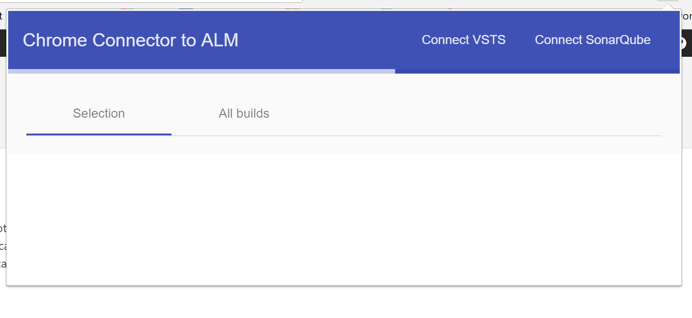
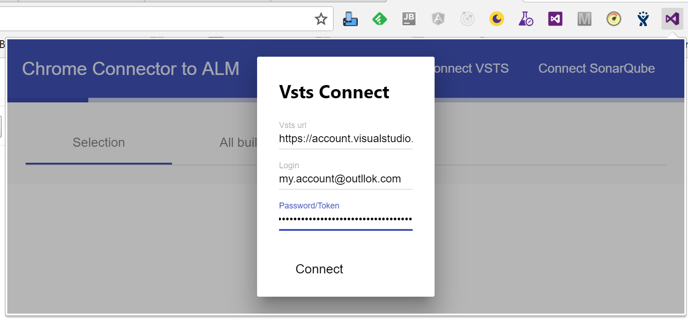
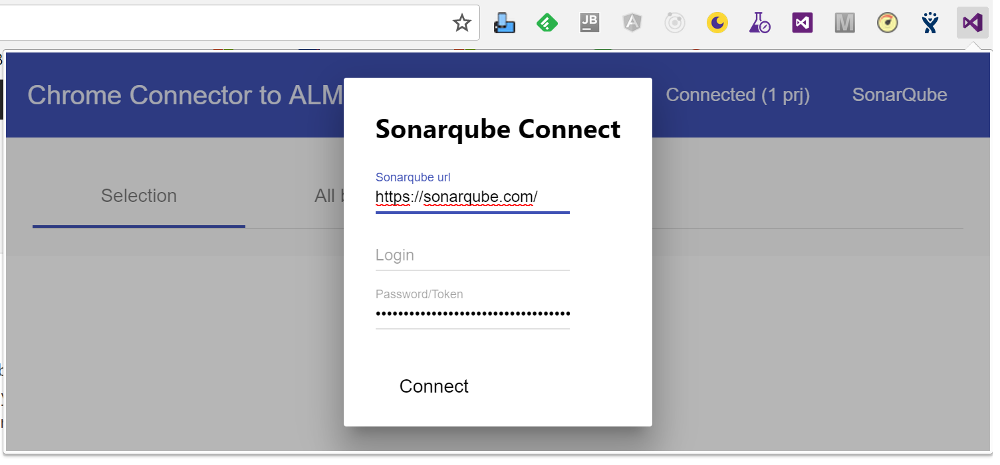
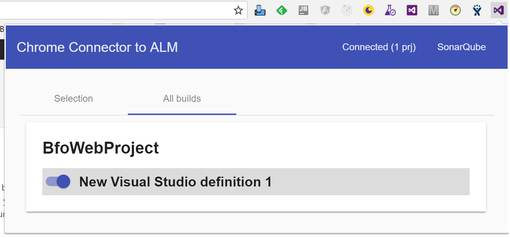
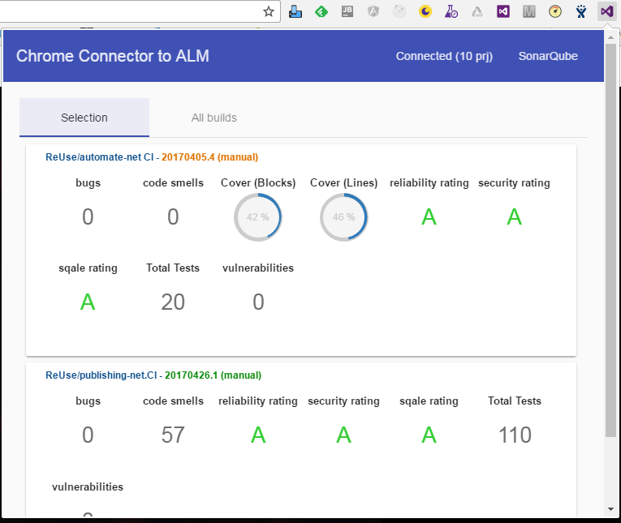

# vsts-follower
Follow your projects on VSTS with SonarQube

## Chrome Extension
This is the chrome extension version of our follower. 
You can download it on [This link](https://chrome.google.com/webstore/detail/alm-follower/onclflpcmjmnfbefnenpakeakhneliof).

### First use
Launch extension and click on "Connect VSTS"

At the modal frame, put your vsts connection informations. For the password, only the personnal access token works.

When "Connect" button clicked, please click on "Connect SonarQube" button

To connect on sonarqube, you have to fill in the url and put a personal token in the zone password / token. Now, you can click on connect and follow your builds.

### All builds tab
It used to select builds that you want to follow.

To select one, click on toggle at the left of build definition name.

### Selection tab
It contains the selected builds and displays their details (build / sonar indicators)

# Contributing
## Prerequisites

[Node.js](http://nodejs.org/) must be installed.

## Installation

* Running `npm install` will install everything you need for development.

## Running Tests

* `ng test` will run the tests once.

## Building

* `ng build` will build the extension for publishing to npm.
* `npm build --watch` will build the extension continuously.

## Test your app
1. open [Extensions form](chrome://extensions/) on your Chrome.
2. Click Developer mode > Load unpacked extensions...
3. Browse to and Select the folder where your manifest.json file is and logo.
> If your file doesn't immediately load, check to make sure the JSON code is formatted correctly with the [JSON Validator](http://jsonlint.com/).
4. Open a new tab in Chrome to see if your app loads and functions correctly. If not, tweak it and test it until it's working correctly in your browser.